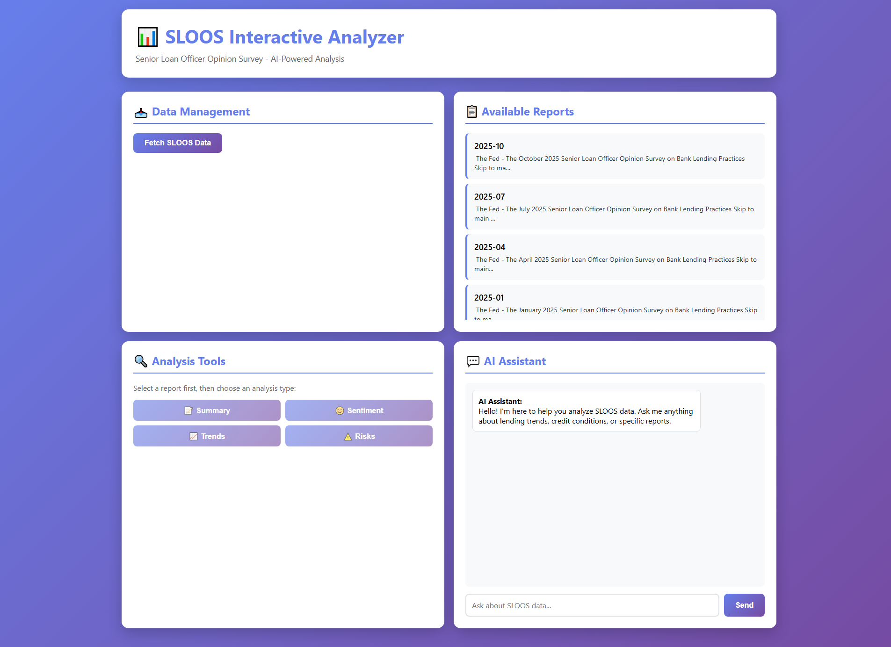
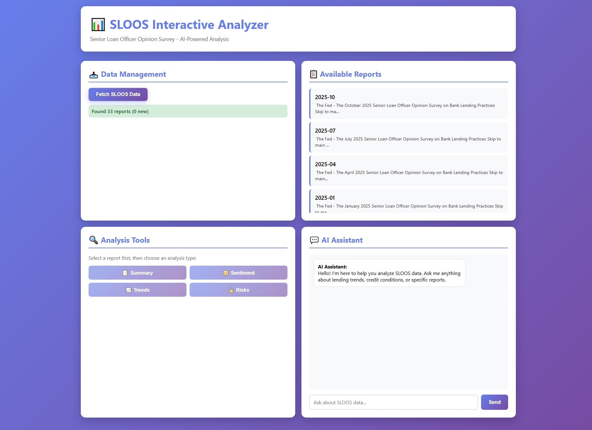
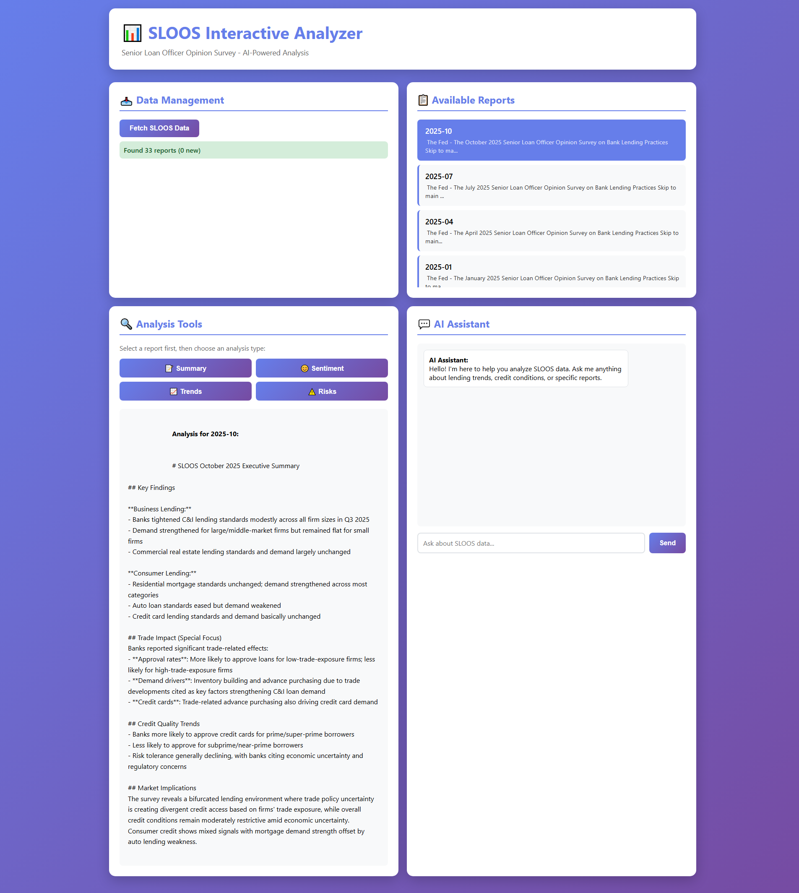
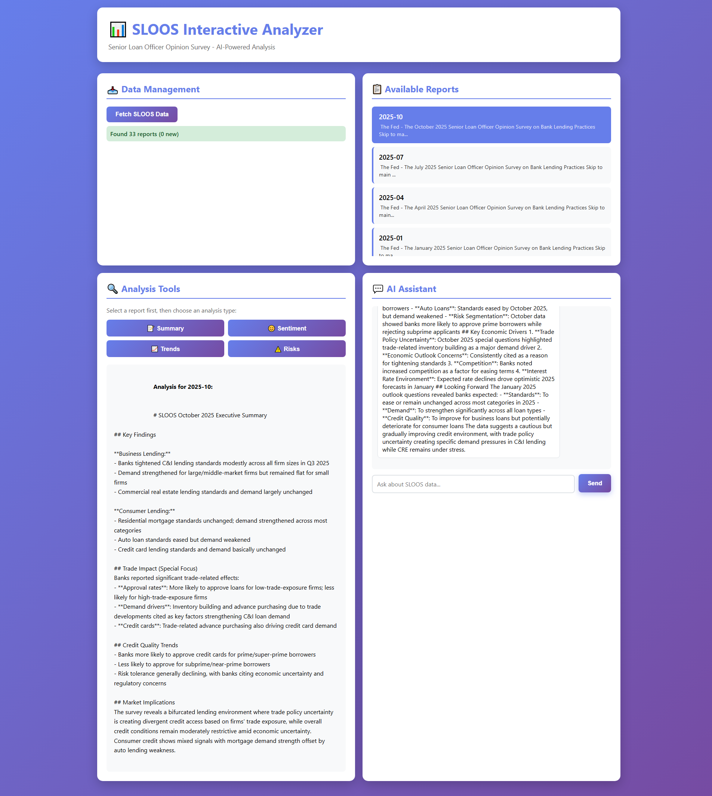

# 📊 SLOOS Interactive Analyzer

> **🤖 100% AI-Generated Project** - This entire application was developed by Kiro AI Software Engineer with zero human coding. From architecture to implementation, documentation to screenshots - all created through AI-assisted development in a single 2-hour session.

Professional web application for analyzing Senior Loan Officer Opinion Survey (SLOOS) data using AWS Bedrock Claude AI.



## Features

- 📥 **Real Data Fetching** - Automatically scrapes SLOOS reports from Federal Reserve website
- 🤖 **AI-Powered Analysis** - Uses AWS Bedrock Claude Sonnet 4 for intelligent analysis
- 📊 **Multiple Analysis Types** - Summary, Sentiment, Trends, and Risk analysis
- 💬 **Interactive Chat** - Ask questions about SLOOS data in natural language
- 💾 **SQLite Database** - Persistent storage for reports and analysis history
- 🎨 **Modern UI** - Professional, responsive web interface

## Quick Start

### Prerequisites

- Python 3.11+
- UV package manager
- AWS credentials with Bedrock access

### Installation

```bash
# Install UV
curl -LsSf https://astral.sh/uv/install.sh | sh  # Linux/Mac
# or
powershell -c "irm https://astral.sh/uv/install.ps1 | iex"  # Windows

# Install dependencies
uv sync

# Configure AWS (if not using EC2 IAM role)
aws configure
# or set environment variables:
export AWS_DEFAULT_PROFILE=your-profile
export AWS_DEFAULT_REGION=us-east-1
```

### Run Application

```bash
# Start server
uv run python app.py

# Access at http://localhost:7251
```

## Screenshots

### Main Dashboard

*Interactive dashboard with data management, reports list, analysis tools, and AI chat*

### Reports List

*SLOOS reports fetched from Federal Reserve website*

### AI Analysis

*AI-powered analysis using AWS Bedrock Claude Sonnet 4*

### Chat Interface

*Natural language Q&A about SLOOS data*

## Usage

1. **Fetch Data** - Click "Fetch SLOOS Data" to download reports from Federal Reserve
2. **Select Report** - Choose a report from the list
3. **Analyze** - Click Summary, Sentiment, Trends, or Risks for AI analysis
4. **Chat** - Ask questions about the data in natural language

## Configuration

Edit `app.py` to customize:

```python
AWS_REGION = "us-east-1"
BEDROCK_MODEL = "us.anthropic.claude-sonnet-4-20250514-v1:0"
DATABASE_URL = "sqlite:///./sloos_data.db"
```

## AWS Setup

### Local Development

Set AWS credentials:
```bash
# Option 1: AWS CLI
aws configure

# Option 2: Environment variables
export AWS_DEFAULT_PROFILE=your-profile
export AWS_DEFAULT_REGION=us-east-1

# Option 3: Credentials file
# ~/.aws/credentials
[default]
aws_access_key_id = YOUR_KEY
aws_secret_access_key = YOUR_SECRET
```

### Production (EC2)

Deploy to EC2 with IAM role:
```json
{
  "Version": "2012-10-17",
  "Statement": [{
    "Effect": "Allow",
    "Action": ["bedrock:InvokeModel"],
    "Resource": "arn:aws:bedrock:us-east-1::foundation-model/us.anthropic.claude-sonnet-4-*"
  }]
}
```

See [DEPLOYMENT.md](DEPLOYMENT.md) for detailed instructions.

## Project Structure

```
.
├── app.py                  # FastAPI backend
├── templates/
│   └── index.html         # Web interface
├── pyproject.toml         # Dependencies
├── sloos_data.db          # SQLite database (auto-created)
├── screenshots/           # Application screenshots
├── README.md              # This file
├── INFO.md                # SLOOS background information
├── QUICKSTART.md          # Quick reference guide
├── SETUP.md               # Detailed setup instructions
├── LOCAL_SETUP.md         # Local development guide
├── DEPLOYMENT.md          # Production deployment guide
└── PROJECT_SUMMARY.md     # Executive summary with ROI analysis
```

## API Endpoints

- `GET /` - Web interface
- `GET /api/reports` - List all reports
- `POST /api/fetch-data` - Fetch SLOOS data from Federal Reserve
- `POST /api/analyze` - Analyze report with AI
- `POST /api/chat` - Chat with AI about data
- `GET /api/chat-history` - View chat history

## Technology Stack

- **Backend**: FastAPI, Python 3.11+
- **AI**: AWS Bedrock (Claude Sonnet 4)
- **Database**: SQLite
- **Data Fetching**: httpx, BeautifulSoup
- **Package Manager**: UV

## Documentation

- [INFO.md](INFO.md) - Understanding SLOOS data
- [PROJECT_SUMMARY.md](PROJECT_SUMMARY.md) - Executive summary & ROI analysis
- [QUICKSTART.md](QUICKSTART.md) - Quick reference
- [SETUP.md](SETUP.md) - Detailed setup
- [LOCAL_SETUP.md](LOCAL_SETUP.md) - Local development
- [DEPLOYMENT.md](DEPLOYMENT.md) - Production deployment

## Troubleshooting

**AWS Credentials Error**
```
Error: AWS credentials not configured
```
Solution: Configure AWS CLI or set environment variables (see LOCAL_SETUP.md)

**Model Not Found**
```
Error: ValidationException - model not supported
```
Solution: Ensure using inference profile ID (us.anthropic.claude-sonnet-4-*)

**Port Already in Use**
```
Error: Address already in use
```
Solution: Change port in app.py or stop existing process

## Cost Considerations

- **Bedrock**: ~$0.003 per 1K input tokens, ~$0.015 per 1K output tokens
- **Typical Analysis**: $0.01-0.05 per request
- **EC2**: ~$30-50/month for t3.medium

See [PROJECT_SUMMARY.md](PROJECT_SUMMARY.md) for detailed ROI analysis.

## License

MIT License - Free to use and modify

## Contributing

Contributions welcome! Please ensure:
- Code follows existing style
- All features are tested
- Documentation is updated

## Support

For issues or questions:
1. Check documentation files
2. Review error messages in browser console
3. Check server logs for detailed errors

---

Built with ❤️ using FastAPI, AWS Bedrock, and UV
